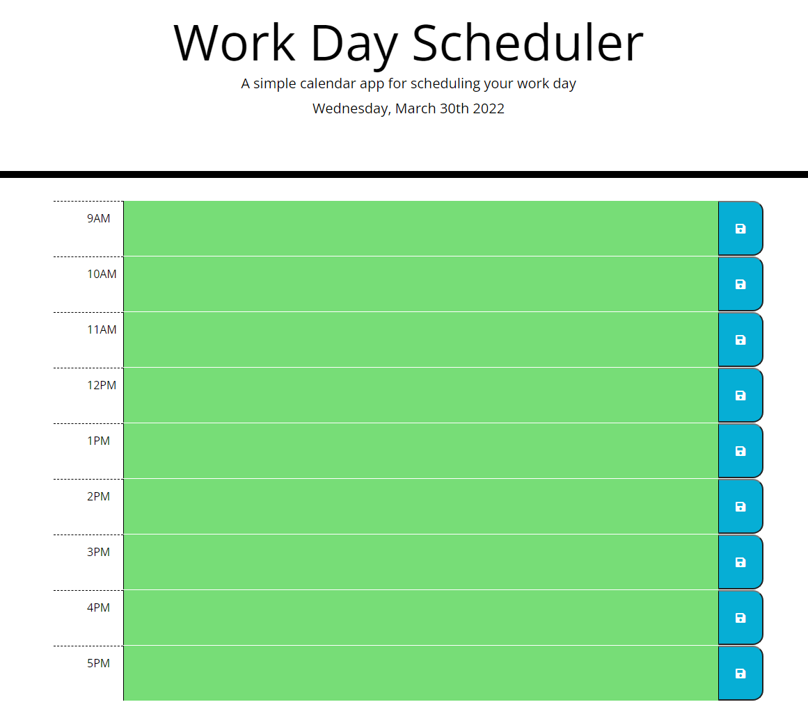

# Amazing work day scheduler

## Purpose
A website that offer a work day scheduler by using a thrid-party APIs that can save the data in local storage. The time block is color-coded to indicate whether it is in the past, present, or future. 

## Built with
* HTML
* CSS
* JavaScript
* jQuery

## Website
https://infinissible.github.io/Amazing-work-day-scheduler/

## Screenshot

## Questions

Find me on GitHub
infinissible
repo: https://github.com/infinissible

Email me with any questions
infinissible@gmail.com
